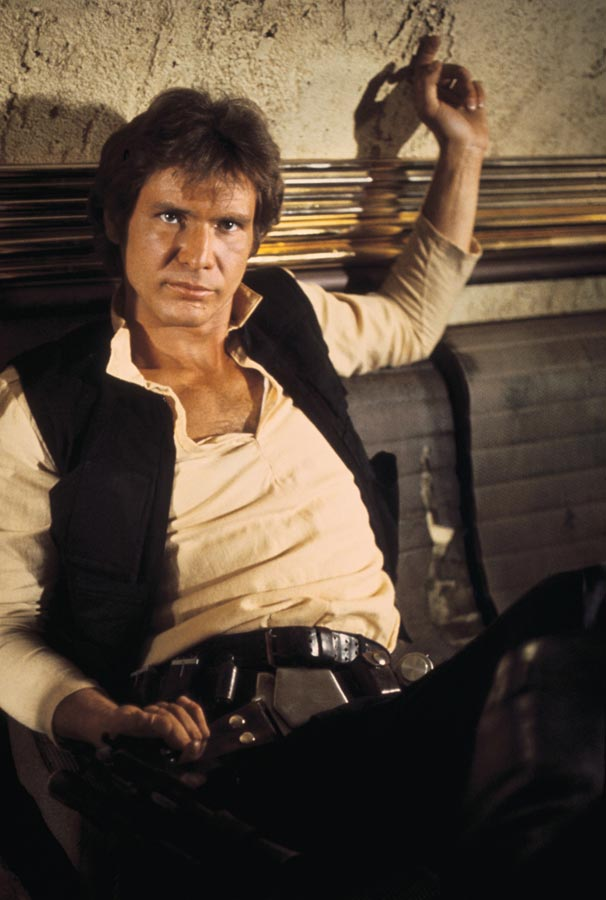
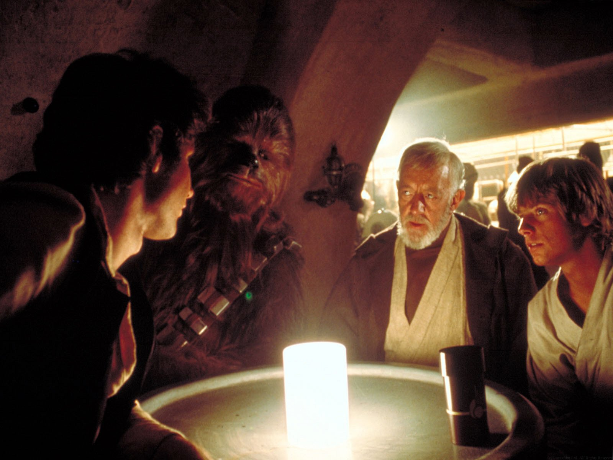
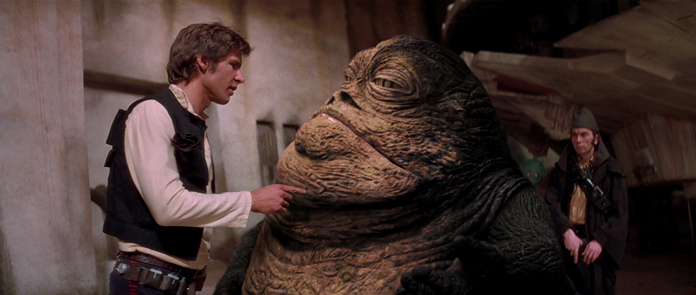
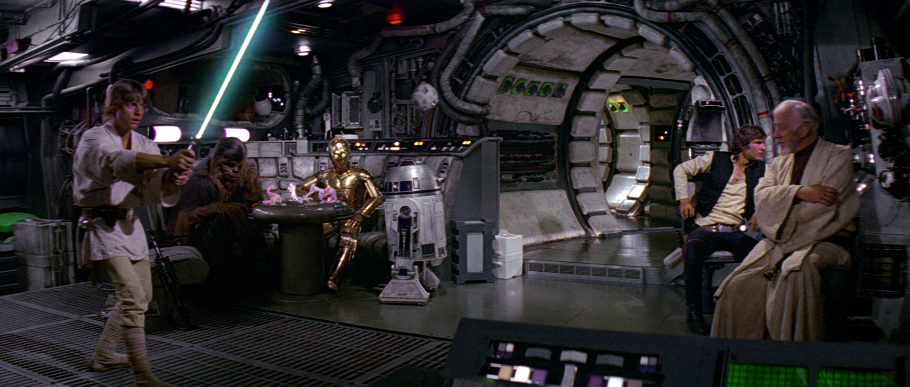
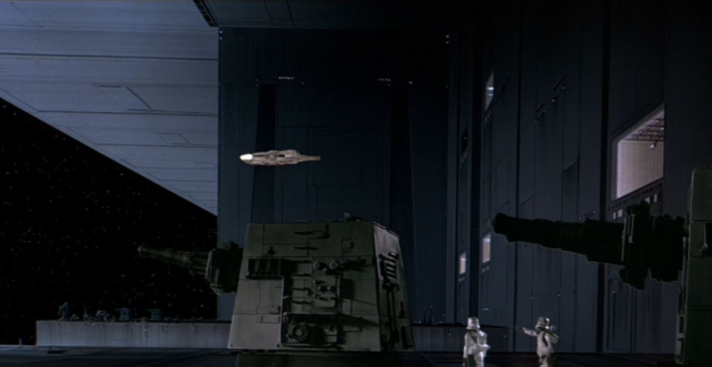

>Never tell me the odds!

## Han Solo

*Han Solo* was a [human](http://starwars.wikia.com/wiki/Human) [male](http://starwars.wikia.com/wiki/Sexes) [smuggler](http://starwars.wikia.com/wiki/Smuggler) who became a leader in the [Alliance to Restore the Republic](http://starwars.wikia.com/wiki/Alliance_to_Restore_the_Republic) and an instrumental figure in the defeat of the [Galactic Empire](http://starwars.wikia.com/wiki/Galactic_Empire) during the [Galactic Civil War](http://starwars.wikia.com/wiki/Galactic_Civil_War).
He hailed from [Corellia](http://starwars.wikia.com/wiki/Corellia) and became a smuggler in the employ of [Jabba](http://starwars.wikia.com/wiki/Jabba_Desilijic_Tiure) the [Hutt](http://starwars.wikia.com/wiki/Hutt), even completing the [Kessel Run](http://starwars.wikia.com/wiki/Kessel_Run) in less than twelve [parsecs](http://starwars.wikia.com/wiki/Parsec) with his prized ship, the [_Millennium Falcon_](http://starwars.wikia.com/wiki/Millennium_Falcon).
He was the son-in-law of fallen [Jedi Knight](http://starwars.wikia.com/wiki/Jedi_Knight) [Anakin Skywalker](http://starwars.wikia.com/wiki/Anakin_Skywalker) and [Senator](http://starwars.wikia.com/wiki/Senator) [Padmé Amidala](http://starwars.wikia.com/wiki/Padm%C3%A9_Amidala), husband of [Leia Organa](http://starwars.wikia.com/wiki/Leia_Organa), brother-in-law of [Luke Skywalker](http://starwars.wikia.com/wiki/Luke_Skywalker), father of [Ben Solo](http://starwars.wikia.com/wiki/Kylo_Ren), rivals and close friends with fellow smuggler [Lando Calrissian](http://starwars.wikia.com/wiki/Lando_Calrissian), and best friends with the [Wookiee](http://starwars.wikia.com/wiki/Wookiee) [Chewbacca](http://starwars.wikia.com/wiki/Chewbacca), his trusted co-pilot who swore a life debt to the Corellian smuggler.

### Biography

#### Early life

Han Solo was born on the planet Corellia during the waning years of the Galactic Republic.
He was orphaned at a young age, and turned to a life of crime as a thief in order to survive the perils of the galaxy.
Solo, at some point, acquired a starship and became an exceptional pilot.
Solo began working outside of the Galactic Empire's laws, beginning a career in illegal smuggling.
Solo eventually met the Wookiee Chewbacca, whom he saved from imprisonment.
Chewbacca, grateful for Solo's intervention, proclaimed a life debt to the smuggler.
Chewbacca thereby became Solo's first mate aboard his ship and the smuggling duo became lifelong friends.
Solo and Chewbacca, at some point, met the self-proclaimed galactic entrepreneur and gambler Lando Calrissian, against whom Solo played a game of "Corellian Spike" Sabacc using a pair of gold dice.
During which, Solo gambled for and won Calrissian's YT-1300 light freighter, the Millennium Falcon.

The Falcon instantly became Solo's most prized possession and he tied the pair of golden dice he used in the momentous game together and hung them in the Falcon's cockpit.
With their new-found ship and confidence, Solo and Chewbacca began engaging in much more dangerous and risky smuggling operations.
Around the same time, Chewbacca likewise hung a pair of chance cube dice above the freighter's piloting console.

During his early years as a smuggler, Solo devised a plot to get revenge against a crime lord who operated a gambling den on the planet Stenness, and had continuously double-crossed spice smugglers.
In order for the escapade to look as legitimate as possible, Solo and his fellow scoundrels arranged a fraudulent marriage ceremony where Solo and the woman Sana Starros were illegitimately married.
The robbery occurred, too, and Solo was given his share.
However, Solo also took Starros's share and fled, leaving Starros in a dire situation.
As a result, Starros came to believe that the only thing Solo was good for was lying, likening him to a "scoundrel."
Solo and Chewbacca also crash-landed on an unnamed planet in the Monsua Nebula that was entirely covered in electrical super-storms and cyclones.
But beneath the storms, a beautiful oasis laid. Solo and his copilot located a cave that they turned into a secret hiding place, storing Corellian wine and other things within.
He and Chewbacca used the den several times over the years.

Eventually, the pair came into the employment of the Outer Rim crime lord Jabba the Hutt, who was based on the desert planet Tatooine and was the leader of the powerful Hutt Clan.
Solo and Chewbacca smuggled for Jabba for many years and Solo became Jabba's top smuggler.
The smuggling duo also spent much time in Chalmun's Cantina looking for work.
However, they were forced to dump a shipment of valuable spice, an addictive drug, when the Falcon was boarded by an Imperial crew who would have surely arrested Solo and Chewbacca if they had been caught with the illicit drug.
Solo and Chewbacca returned to Jabba, who placed a large bounty of 50,000 credits on the pair; it was only intended to be removed if Solo paid restitution for the Hutt's loss.
Solo, some time later, in order to repay the Hutt, smuggled for the Pyke Syndicate, who controlled a near-monopoly over the spice trade, from the planet Kessel where the syndicate's controlled the spice mines of Kessel.
Solo and Chewbacca were hired to transport spice from Kessel to the syndicate's customers; known as the foolhardy Kessel Runs.
Using the Falcon, Solo broke a long-held record for the Kessel Run, he completed the challenge in less than twelve parsecs.

==== Galactic Civil War

Some time after losing Jabba's cargo, Solo and Chewbacca traveled to Chalmun's Cantina to look for work to pay off Jabba.
Chewbacca soon met Jedi Master Obi-Wan Kenobi, also known as Ben Kenobi, who was seeking charter to the Alderaan system on a mission of vital importance for the Alliance to Restore the Republic.
Kenobi defended young Skywalker from the criminals Ponda Baba and Cornelius Evazan with his lightsaber; revealing himself as a Jedi before making their way to Solo's booth.
They arrived and began bartering terms of the deal.
Solo assured Kenobi that the Millennium Falcon was the fastest ship around, because it had made the Kessel Run in less than twelve parsecs.
Kenobi informed Solo that the cargo was only himself, Skywalker and two droids, and that they wanted to avoid Imperials entirely.
Therefore, Solo set the price at 10,000 credits—higher than he normally would have.
However, Kenobi raised Solo's bid to 17,000 credits: 2,000 in advance and 15,000 when they reached Alderaan.
Solo was perplexed that Kenobi had raised his bid and quickly accepted the deal.
The smuggler then told his temporary employer to meet him in Docking Bay 94 for departure as soon as he was ready, before warning Kenobi that some Imperial sandtroopers had entered the cantina and were looking for Evazan and Baba's attacker.
Kenobi and Skywalker hastily fled, leaving Solo to express his elation to Chewbacca at having garnered such a high-paying job to pay off Jabba.
Chewbacca left as well right after.

As Solo got up to leave, he was confronted by one of Jabba's bounty hunters: the Rodian, Greedo.
Greedo demanded to be paid Jabba's debt, or he would take Solo's dead body back to Jabba as payment.
Solo, then, in self defense, covertly pulled his DL-44 blaster pistol and shot Greedo from under the table a fraction of a second after Greedo fired his own weapon—though, Solo hit his target and Greedo did not.
Solo ignored the Murder tax Jabba enforced on Tatooine, opting instead to simply toss Wuher, the cantina's bartender, some credit chips, before apologizing for leaving a mess and then heading to Docking Bay 94.

Solo arrived in the docking and found Jabba himself, with several of his guards—including Jabba's top bounty hunter Boba Fett—looking for him near the Falcon.
Jabba inquired as to whether Solo was going to pay him, and why he had "fried poor Greedo."
Jabba was disappointed in having to put the bounty on Solo; the crime lord's top smuggler.
Solo insisted he had had no choice but to dump the cargo, and informed the Hutt that he had secured a charter that would be able to compensate the Hutt's loss in full as soon as he completed it.
Jabba was pleased and added that if Solo paid twenty percent interest all could be forgotten, however, Solo talked him down to fifteen percent, and ironically stated that the Hutt was a "wonderful Human being," before entering the Falcon.

A short time later, Kenobi, Skywalker and their two droids, the protocol droid C-3PO, and the astromech droid R2-D2, boarded the Falcon after Skywalker remarked that the Falcon appeared to be a "piece of junk."
Solo corrected him: The Millennium Falcon looked out-of-shape, but had been given "special modifications" that made it one of the fastest ships in the galaxy.
Just then, a squad of stormtroopers appeared in the docking bay and opened fire on Solo.
Solo fired back while retreating on board and shouted for Chewbacca to take off.
The Falcon blasted away from the Mos Eisley spaceport and clear of Tatooine.
Solo inserted coordinates to the Alderaan system into the Falcon's navigation computer while teaching farmboy Skywalker the importance of entering the correct coordinates—If it was not done correctly, the ship could run into any number of dangers associated with space travel.
The Falcon outran two Imperial Star Destroyers and jumped into hyperspace.

While en route to Alderaan, Solo boasted of outrunning the "Imperial slugs," but was annoyed when no one would humor him.
Chewbacca and R2-D2, often shortened to Artoo, were playing a game of Dejarik when Artoo outplayed the Wookiee, so Solo warned the droids not to upset him because Wookiee rage was not something C-3PO, often shortened to Threepio, a droid programmed in protocol would want to experience.
Skywalker, meanwhile, trained with a remote with his lightsaber, trying to deflect the sting bolts with the civilized weapon.
Solo was skeptical of the Force—the energy field that connected all living things in the galaxy, and the Jedi, like Kenobi, were able to use to perform seemingly supernatural feats—because in all his travels he had never seen proof that pointed to its existence; to Solo, it was all "simple tricks and nonsense."
Kenobi took Solo's skepticism as a challenge and put a helmet over Luke's face so he couldn't see.
Skywalker tried to deflect the bolts again, and did, while unable to see.
Solo was mildly impressed, but acquitted Skywalker's ability to luck.

Immediately after, the Falcon emerged from hyperspace in the Alderaan system.
The Falcon came out at Alderaan's galactic coordinates, but into a meteor shower, with Alderaan nowhere in sight.
Kenobi, using the Force, realized the asteroid field was Alderaan: The entire planet had been destroyed by the Empire.
Solo couldn't believe the Empire had had enough firepower to do so, even with their entire fleet, but then an Imperial short-range TIE fighter appeared, seemingly confirming Kenobi's suspicions.
Skywalker and Solo both conflated that if the fighter identified them as the freighter that had blasted away from Tatooine, they would be damned.
Therefore, Solo got in range to destroy it.
Kenobi, however, argued against it before Solo realized that the fighter did have a base; what appeared to be a small moon that was seen in the distance.
Kenobi quickly surmised that the moon was not a moon, but an Imperial space station, the Death Star battle station equipped with a superlaser that was capable of destroying entire planets.
Solo was shocked at the Death Star's 120 kilometer spherical diameter and prepared to turn the Falcon around and retreat.
One of the station's tractor beams, however, began to pull the Falcon in.
Solo prepared to fight his way out once they were taken aboard and shut the freighter down.
Kenobi was able to talk Solo into listening to him, though: hide instead of fight.
Therefore, they ejected the Falcon's five Model CEC Class-1 escape pods and hid themselves in the Falcon's smuggling compartments located under the floor.

